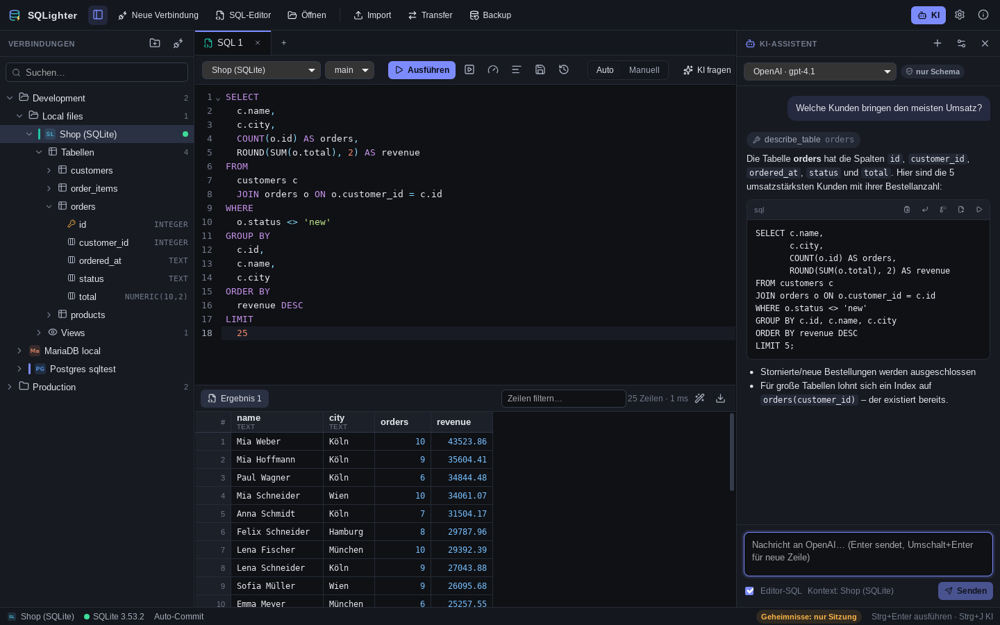
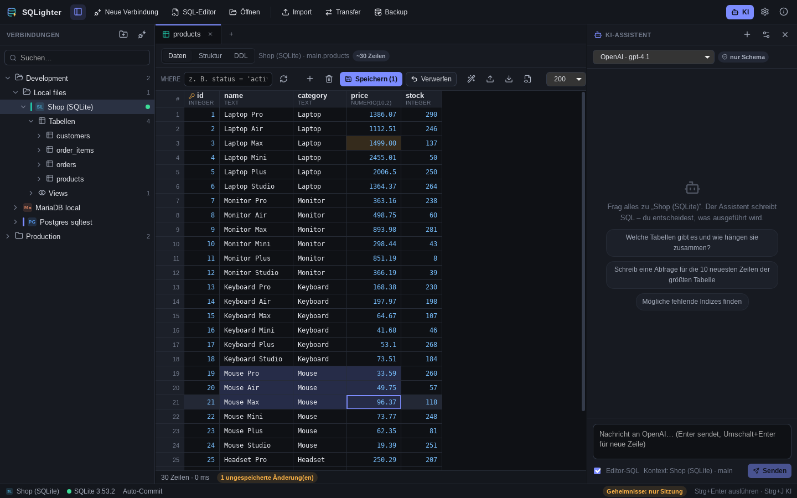
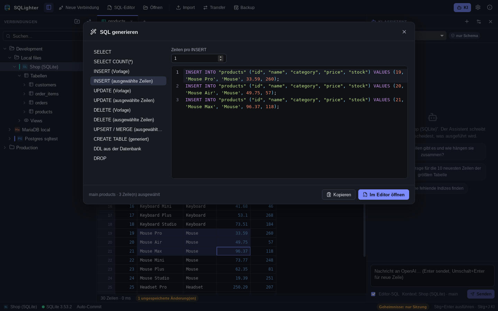
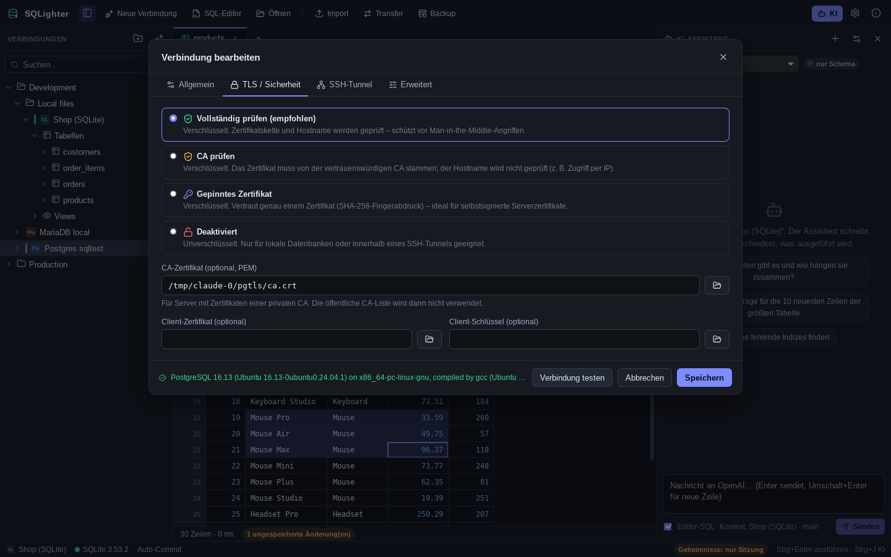
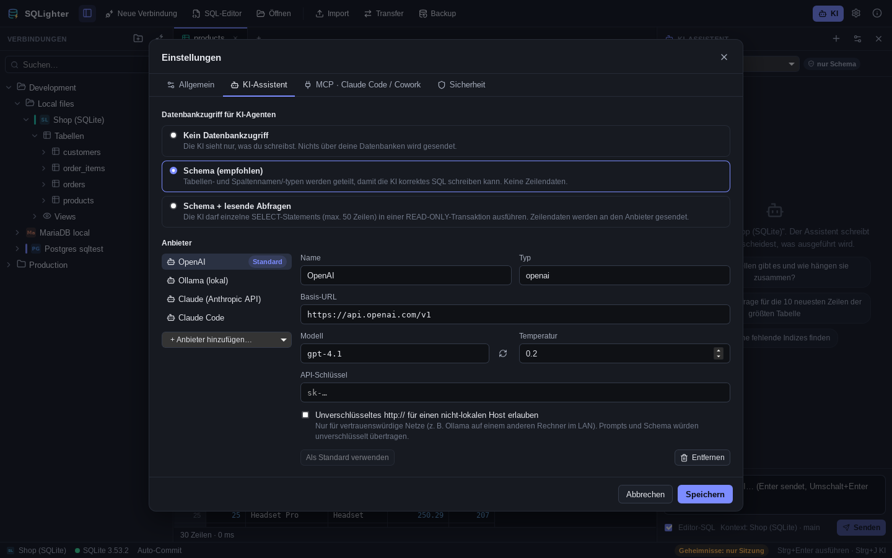
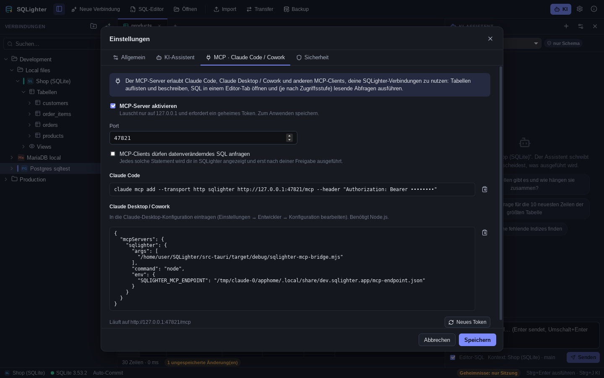
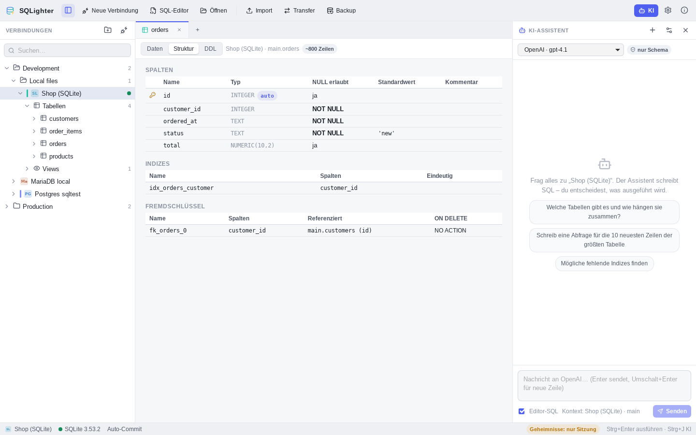

<p align="center">
  
</p>

<h1 align="center">SQLighter</h1>

<p align="center">
  Ein moderner, minimalistischer und sicherer SQL-Client mit eingebautem KI-Assistenten.<br/>
  <sub>A modern, minimal and secure SQL client with a built-in AI assistant — <a href="#english">English summary below</a>.</sub>
</p>

<p align="center">
  PostgreSQL · MySQL · MariaDB · SQLite · SQL Server · Oracle · CockroachDB
</p>



## Überblick

SQLighter ist wie DBeaver – nur aufgeräumt: links die Verbindungen (in Ordnern), in der Mitte Editor und Daten, rechts der KI-Assistent. Die App ist mit **Tauri 2 + Rust** gebaut (klein, schnell, ~10–20 MB Installer) und hat eine **React**-Oberfläche.

| | |
|---|---|
|  |  |
|  |  |
|  |  |

## Funktionen

**Verbindungen**
- PostgreSQL, MySQL, MariaDB, SQLite, SQL Server, Oracle (optional, siehe unten), CockroachDB
- Verbindungen in **Ordnern und Unterordnern** organisieren (Drag & Drop), Farben, Suche
- Markierung als **Produktion** (jede Änderung muss bestätigt werden) und **Read-only** (auch auf DB-Ebene erzwungen, wo möglich)
- **SSH-Tunnel** (Passwort, privater Schlüssel, SSH-Agent) mit Host-Key-Prüfung

**Arbeiten mit SQL**
- Editor mit Syntax-Highlighting je Dialekt, Autovervollständigung aus dem Schema, Formatter
- `Strg+Enter` führt das Statement am Cursor aus, `Strg+Umschalt+Enter` das ganze Skript (versteht `$$`-Blöcke, `DELIMITER`, `GO`, PL/SQL, Trigger)
- Mehrere Ergebnisse als Tabs, Abbrechen laufender Abfragen, Explain, Abfrageverlauf
- **Auto-Commit oder manuelle Transaktionen** mit Commit/Rollback
- Sicherheitsabfrage vor `DROP`, `TRUNCATE` und `DELETE`/`UPDATE` ohne `WHERE`

**Daten**
- Virtualisiertes Grid: Zellbereiche markieren, kopieren (TSV, CSV, JSON, Markdown), sortieren, filtern
- **Tabellendaten direkt bearbeiten**: Zellen ändern, Zeilen hinzufügen/löschen – mit **SQL-Vorschau** und Ausführung in einer Transaktion
- Struktur-Ansicht (Spalten, Indizes, Fremdschlüssel) und DDL
- Objektbaum mit Schemas, Tabellen, Views, Materialized Views, Funktionen, Prozeduren, Sequenzen und Spalten

**SQL-Generator**
- Aus Tabellen oder ausgewählten Zeilen: `SELECT`, `INSERT` (Vorlage oder konkrete Zeilen, Mehrzeilen-Batches), `UPDATE`, `DELETE`, `UPSERT`/`MERGE`, `CREATE TABLE`, `DROP`
- `CREATE TABLE` auch für einen **anderen Dialekt** (z. B. PostgreSQL → MySQL) und aus beliebigen Abfrageergebnissen

**Import / Export / Backup**
- Export: **CSV, TSV, Excel (XLSX), JSON, XML, SQL-INSERT, Markdown, HTML** – aus Ergebnissen, Abfragen oder ganzen Tabellen (gestreamt)
- Import: **CSV, TSV, JSON, XML, Excel/ODS** mit Vorschau, Spaltenzuordnung und optional neuer Tabelle – alles in einer Transaktion
- **Datenbank → Datenbank-Transfer** (z. B. SQLite → PostgreSQL) inkl. Typkonvertierung
- **Backups** als portabler SQL-Dump (alle Datenbanken, optional gzip) oder mit den nativen Werkzeugen (`pg_dump`, `mysqldump`/`mariadb-dump`, SQLite-Online-Backup); **Wiederherstellen** von `.sql`, `.sql.gz` oder `pg_restore`-Archiven

**KI-Assistent**
- **Ollama** (lokal), **OpenAI-kompatible APIs** (OpenAI, LM Studio, OpenRouter, vLLM, …), **Claude über die Anthropic-API** und **Claude Code** (lokale CLI mit deinem Abo)
- Der Assistent kennt Dialekt und Schema, nutzt Werkzeuge (`list_tables`, `describe_table`, optional read-only `run_query`) und schreibt SQL, das du mit einem Klick einfügst, ersetzt oder ausführst
- **Claude Desktop / Cowork und Claude Code** können SQLighter über den eingebauten **MCP-Server** nutzen (Tabellen ansehen, SQL im Editor öffnen, auf Wunsch Änderungen nach deiner Freigabe ausführen)

**Oberfläche**: Deutsch und Englisch, dunkles und helles Design, anpassbare Panels, Tastenkürzel.

## Sicherheit

Sicherheit war ein Kernziel – insbesondere Schutz vor Man-in-the-Middle-Angriffen. Details in [SECURITY.md](SECURITY.md).

- **TLS ohne Hintertür**: „Vollständig prüfen“ (Kette + Hostname, Standard), „CA prüfen“ oder **Zertifikat-Pinning** (SHA-256, Trust-on-First-Use mit Anzeige des Fingerabdrucks). Einen unsicheren Modus „verschlüsseln ohne Prüfung“ gibt es bewusst nicht.
- **Unverschlüsselte Verbindungen zu entfernten Hosts werden abgelehnt**, außer man akzeptiert das Risiko ausdrücklich pro Verbindung (oder nutzt einen SSH-Tunnel).
- **SSH-Hostschlüssel** werden gegen `~/.ssh/known_hosts` bzw. den gespeicherten Fingerabdruck geprüft; ein **geänderter Schlüssel blockiert** die Verbindung mit deutlicher Warnung.
- **Passwörter, Passphrasen und API-Schlüssel** liegen im Schlüsselbund des Betriebssystems (macOS Keychain, Windows Credential Manager, Secret Service) – nie in Konfigurationsdateien. Ohne Schlüsselbund bleiben sie nur im Speicher.
- **KI mit Leitplanken**: Zugriffsstufen *kein Zugriff* / *nur Schema* / *Schema + lesende Abfragen*. Lesende Abfragen laufen in einer `READ ONLY`-Transaktion, die immer zurückgerollt wird; KI-Agenten führen nie selbst Änderungen aus. KI-Endpunkte müssen HTTPS nutzen (HTTP nur für localhost oder explizite Ausnahme).
- **Claude Code** läuft ohne Shell- und Dateiwerkzeuge und sieht ausschließlich SQLighters MCP-Werkzeuge über ein kurzlebiges, verbindungsgebundenes Token.
- **MCP-Server**: nur `127.0.0.1`, 256-Bit-Token, Schutz vor DNS-Rebinding und Browser-Zugriffen, Schreibzugriff standardmäßig aus und dann **pro Statement freizugeben**.
- **Gehärtete Oberfläche**: strikte Content Security Policy, keine Navigation weg von der App, keine Dateisystem-/Shell-Plugins; die UI darf nur Dateien lesen/schreiben, die im nativen Dateidialog gewählt wurden.

## Installation

Fertige Installer (Windows `.msi`/`.exe`, macOS `.dmg`, Linux `.AppImage`/`.deb`/`.rpm`) erzeugt der Release-Workflow bei jedem Tag `v*` (siehe `.github/workflows/release.yml`).

### Selbst bauen

Voraussetzungen: [Node.js 20+](https://nodejs.org), [Rust](https://rustup.rs) und die [Tauri-Systemabhängigkeiten](https://v2.tauri.app/start/prerequisites/) (Linux: `libwebkit2gtk-4.1-dev`, `librsvg2-dev`, `build-essential` …).

```bash
npm install
npm run app:dev      # Entwicklung mit Hot Reload
npm run app:build    # Installer für das aktuelle Betriebssystem
```

**Oracle** wird über den [Oracle Instant Client](https://www.oracle.com/database/technologies/instant-client.html) angebunden, der zur Laufzeit geladen wird. Ohne Instant Client funktioniert alles andere normal; Oracle-Verbindungen melden dann einen klaren Hinweis. Ganz ohne Oracle-Unterstützung bauen: `cargo build --no-default-features` in `src-tauri`.

## KI einrichten

Einstellungen (`Strg+,`) → **KI-Assistent**:

| Anbieter | Einrichtung |
|---|---|
| **Ollama** | Ollama installieren, Modell laden (z. B. `ollama pull qwen2.5-coder:7b`). Standard-URL `http://127.0.0.1:11434`. |
| **OpenAI-kompatibel** | Basis-URL (z. B. `https://api.openai.com/v1`, LM Studio `http://127.0.0.1:1234/v1`) und API-Schlüssel. |
| **Claude (Anthropic API)** | API-Schlüssel eintragen, Modell z. B. `claude-sonnet-5`. |
| **Claude Code** | [Claude Code](https://code.claude.com) installieren und einmal `claude` im Terminal ausführen (Anmeldung). SQLighter findet die CLI automatisch. |

Mit **Zugriffsstufe** bestimmst du, was die KI über deine Datenbanken erfährt.

### Claude Code und Claude Desktop / Cowork per MCP

Einstellungen → **MCP · Claude Code / Cowork** → „MCP-Server aktivieren“ → Speichern. SQLighter zeigt dann:

- den Befehl für **Claude Code**: `claude mcp add --transport http sqlighter http://127.0.0.1:47821/mcp --header "Authorization: Bearer …"`
- die Konfiguration für **Claude Desktop / Cowork** (nutzt die mitgelieferte Stdio-Bridge `sqlighter-mcp-bridge.mjs`, benötigt Node.js)

Verfügbare Werkzeuge: `list_connections`, `list_tables`, `describe_table`, `run_query` (nur mit Stufe „lesende Abfragen“), `open_in_editor` und – nur wenn freigeschaltet – `execute_sql` mit Bestätigung in SQLighter.

## Tastenkürzel

| Kürzel | Aktion |
|---|---|
| `Strg+Enter` | Statement am Cursor ausführen |
| `Strg+Umschalt+Enter` / `Alt+X` | Skript ausführen |
| `Strg+Umschalt+F` | SQL formatieren |
| `Strg+Umschalt+E` | Explain |
| `Strg+T` / `Strg+W` | Neuer Editor-Tab / Tab schließen |
| `Strg+S` / `Strg+O` | SQL-Datei speichern / öffnen |
| `Strg+J` | KI-Assistent ein/aus |
| `Strg+B` | Seitenleiste ein/aus |
| `Strg+,` | Einstellungen |

## Entwicklung

```
src/                 React-Oberfläche (TypeScript)
  components/        Seitenleiste, Editor, Grid, Chat, Dialoge
  lib/               API-Schicht, Store, i18n (de/en)
  shared/            Typen, SQL-Splitter/Quoting, SQL-Generator
src-tauri/           Rust-Backend
  src/db/            Treiber (tokio-postgres, mysql_async, rusqlite, tiberius, oracle), Sessions, Metadaten
  src/tls.rs         TLS-Konfiguration inkl. CA-Prüfung und Pinning (rustls)
  src/ssh.rs         SSH-Tunnel mit Host-Key-Prüfung (russh)
  src/io/            Import, Export, Transfer, Backup/Restore
  src/ai/            KI-Anbieter, Werkzeuge, Claude Code
  src/mcp.rs         MCP-Server
  resources/         Stdio-Bridge für Claude Desktop / Cowork
```

Tests:

```bash
npm test                     # TypeScript: SQL-Helfer, Generator, Übersetzungen
npm run typecheck
cd src-tauri
cargo test --lib             # Rust-Unit-Tests
cargo test --test ai_providers   # KI-Protokolle gegen Mock-Server
SQLIGHTER_IT=1 cargo test --test integration -- --test-threads=1   # gegen echte PostgreSQL/MariaDB (siehe Datei)
```

---

<a id="english"></a>
## English summary

SQLighter is a desktop SQL client in the spirit of DBeaver, but calm and modern. It is built with **Tauri 2 (Rust)** and **React**.

- **Databases**: PostgreSQL, MySQL, MariaDB, SQLite, SQL Server, Oracle (via Oracle Instant Client at runtime), CockroachDB; connections organised in folders; SSH tunnels.
- **Editor & data**: dialect-aware editor with completion, formatter, statement-at-cursor execution, transactions, cancel, explain, history; virtualized grid with copy formats and inline editing (SQL preview, single transaction).
- **SQL generator**: SELECT/INSERT/UPDATE/DELETE/UPSERT/MERGE/CREATE TABLE/DROP from tables or selected rows, including cross-dialect DDL.
- **Import/export/backup**: CSV, TSV, XLSX, JSON, XML, SQL, Markdown, HTML; DB-to-DB transfer; portable SQL dumps or native `pg_dump`/`mysqldump`/SQLite backups; restore.
- **AI**: Ollama, OpenAI-compatible APIs, Claude via the Anthropic API and Claude Code; tool calling with access levels; built-in MCP server so Claude Code and Claude Desktop/Cowork can work with your connections.
- **Security**: verified TLS only (full, CA or pinned certificate), refusal of plain-text connections to remote hosts, SSH host key verification with change detection, OS keychain for secrets, read-only transactions for AI queries, locked-down Claude Code, loopback-only token-protected MCP server, strict CSP.

Build: `npm install && npm run app:build`. UI languages: German and English.

## Lizenz

[MIT](LICENSE)
